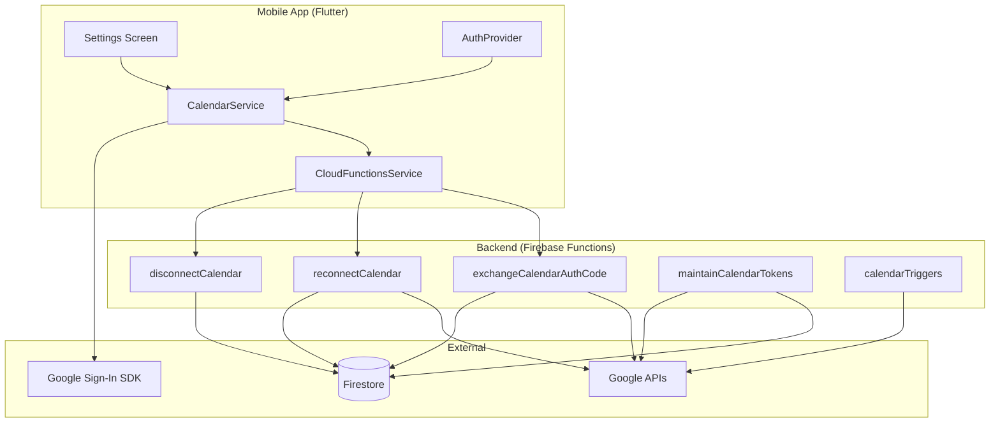
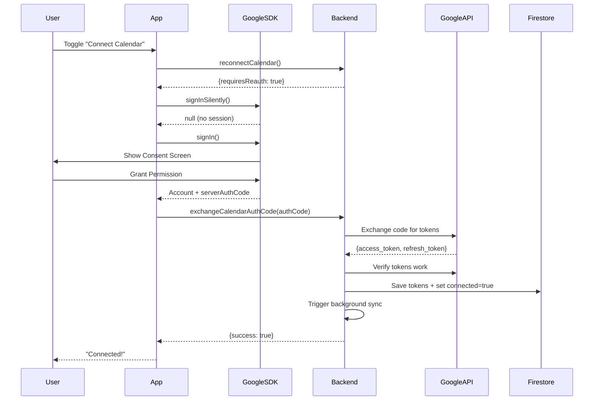
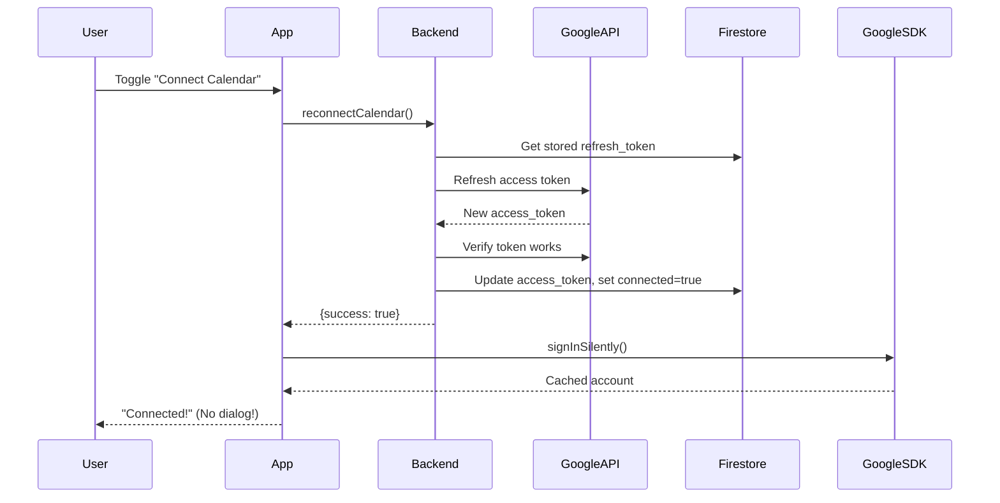

# Google Calendar Integration - Developer Guide

> **Module Version:** 2.0  
> **Last Updated:** January 2026  
> **Status:** Production Ready

---

## Table of Contents

1. [Architecture Overview](#architecture-overview)
2. [OAuth Flow Explained](#oauth-flow-explained)
3. [User Scenarios & Flows](#user-scenarios--flows)
4. [Backend Functions](#backend-functions)
5. [Frontend Services](#frontend-services)
6. [Edge Case Handling](#edge-case-handling)
7. [File Reference](#file-reference)
8. [Testing Checklist](#testing-checklist)

---

## Architecture Overview



### Key Design Decisions

| Decision | Rationale |
|----------|-----------|
| **Server Auth Code Flow** | Backend owns refresh tokens - can sync calendar even when app is closed |
| **Backend Token Storage** | Tokens in Firestore, not device - secure & accessible across devices |
| **Smart Reconnect** | Reuses stored tokens to avoid showing dialogs to returning users |
| **Proactive Verification** | Detects revoked access on login before user tries to use calendar |

---

## OAuth Flow Explained

### Initial Connection (First Time)



### Smart Reconnect (Returning User)



---

## User Scenarios & Flows

### Scenario 1: First Time Connect
| Step | Action |
|------|--------|
| 1 | User toggles calendar switch |
| 2 | Smart Reconnect fails (no tokens) |
| 3 | signInSilently returns null |
| 4 | signIn shows consent dialog |
| 5 | User grants permission |
| 6 | Backend exchanges & stores tokens |
| 7 | UI shows "Connected" |

### Scenario 2: Reconnect (Not Revoked)
| Step | Action |
|------|--------|
| 1 | User toggles calendar switch |
| 2 | Smart Reconnect succeeds (valid tokens) |
| 3 | signInSilently restores session |
| 4 | UI shows "Connected" - **No dialog!** |

### Scenario 3: Reconnect (Access Revoked)
| Step | Action |
|------|--------|
| 1 | User revokes access in Google Settings |
| 2 | User toggles calendar switch |
| 3 | Smart Reconnect returns requiresReauth |
| 4 | signInSilently returns stale account |
| 5 | Backend rejects stale auth code |
| 6 | App detects "expired" error |
| 7 | App calls clearStaleSession() |
| 8 | UI shows "Please logout and login again" |
| 9 | User logs out → logs in |
| 10 | User toggles switch → Consent screen appears |

### Scenario 4: Active Revocation Detection
| Step | Action |
|------|--------|
| 1 | Calendar is connected |
| 2 | User creates a task |
| 3 | Backend tries to create calendar event |
| 4 | Google API rejects (401/invalid_grant) |
| 5 | handleCalendarAuthError() triggers |
| 6 | Firestore: googleCalendarConnected = false |
| 7 | Tokens deleted from Firestore |
| 8 | Notification sent to user |

### Scenario 5: State Persistence (Logout/Login)
| Step | Action |
|------|--------|
| 1 | Calendar is connected |
| 2 | User logs out |
| 3 | CalendarService.reset() called |
| 4 | User logs in |
| 5 | Firestore has googleCalendarConnected = true |
| 6 | UI shows "Connected" |
| 7 | Backend can sync events (has refresh token) |

### Scenario 6: Revoke While Logged Out
| Step | Action |
|------|--------|
| 1 | Calendar is connected |
| 2 | User logs out |
| 3 | User revokes access in Google Settings |
| 4 | User logs in |
| 5 | verifyConnectionStatus() is called |
| 6 | Backend detects invalid tokens |
| 7 | Firestore updated: connected = false |
| 8 | UI reflects "Disconnected" |

### Scenario 7: Dormant Token Expiry (6+ months)
| Step | Action |
|------|--------|
| 1 | maintainCalendarTokens scheduled function runs |
| 2 | Queries users with googleCalendarConnected = true |
| 3 | Attempts to refresh each token |
| 4 | If refresh fails → set connected = false |
| 5 | Send notification to affected users |

---

## Backend Functions

### `exchangeCalendarAuthCode`
**File:** `src/services/calendarService.ts`  
**Type:** Callable Function  
**Purpose:** Exchange one-time auth code for access/refresh tokens

```typescript
// Input
{ authCode: string }

// Output (success)
{ success: true, hasRefreshToken: true }

// Output (failure)
{ success: false, message: "..." }
```

### `reconnectCalendar`
**File:** `src/services/calendarService.ts`  
**Type:** Callable Function  
**Purpose:** Attempt to reconnect using stored refresh token

```typescript
// Output (success)
{ success: true, requiresReauth: false }

// Output (needs reauth)
{ success: false, requiresReauth: true, message: "..." }
```

### `disconnectCalendar`
**File:** `src/services/calendarService.ts`  
**Type:** Callable Function  
**Purpose:** Delete all calendar events and clear connection

```typescript
// Output
{ success: true, deletedEvents: 5 }
```

### `maintainCalendarTokens`
**File:** `src/triggers/scheduledFunctions.ts`  
**Type:** Scheduled Function (1st of month, 3 AM)  
**Purpose:** Proactively refresh tokens for dormant users

### `handleCalendarAuthError`
**File:** `src/services/calendarService.ts`  
**Type:** Internal Function  
**Purpose:** Detect token revocation during calendar operations

---

## Frontend Services

### CalendarService Methods

| Method | Purpose |
|--------|---------|
| `connect(userId)` | Connect calendar - handles all connection logic |
| `disconnect(userId)` | Disconnect calendar - calls backend |
| `reset()` | Clear local state on logout |
| `clearStaleSession()` | Aggressive cleanup for revocation cases |
| `verifyConnectionStatus()` | Proactive verification on login |
| `refreshAccessToken(userId)` | Refresh local token if needed |

### CalendarConnectResult Enum

```dart
enum CalendarConnectResult {
  success,
  userCancelled,
  signInFailed,
  noServerAuthCode,
  backendExchangeFailed,
  verificationFailed,
  networkError,
  accessRevoked,  // ← User must logout and login
  unknownError,
}
```

---

## Edge Case Handling

| Edge Case | Detection | Resolution |
|-----------|-----------|------------|
| Stale auth code | Backend returns "expired or already used" | clearStaleSession() + show logout message |
| Token revoked (active) | 401/invalid_grant during operation | handleCalendarAuthError() resets connection |
| Token revoked (passive) | verifyConnectionStatus() on login | Backend updates Firestore |
| Multiple GoogleSignIn instances | N/A | CalendarService uses its own instance with calendar scopes |
| Infinite verification loop | N/A | `_calendarVerifiedThisSession` flag |
| Account deletion | User deletes account | deleteAllUserCalendarEvents() before deletion |

---

## File Reference

### Frontend (Flutter)

| File | Purpose |
|------|---------|
| `lib/data/services/calendar_service.dart` | Core calendar logic |
| `lib/data/services/cloud_functions_service.dart` | Backend API calls |
| `lib/data/providers/auth_provider.dart` | Login/logout + verification |
| `lib/presentation/settings/settings_screen.dart` | Calendar toggle UI |

### Backend (TypeScript)

| File | Purpose |
|------|---------|
| `src/services/calendarService.ts` | All calendar Cloud Functions |
| `src/triggers/calendarTriggers.ts` | Task→Calendar sync triggers |
| `src/triggers/scheduledFunctions.ts` | Token maintenance job |
| `src/controllers/userController.ts` | Account deletion with cleanup |
| `src/index.ts` | Function exports |

### Configuration

| File | Purpose |
|------|---------|
| `.env` (backend) | GOOGLE_CLIENT_ID, GOOGLE_CLIENT_SECRET |
| `.env` (frontend) | GOOGLE_WEB_CLIENT_ID |

---

## Testing Checklist

### Happy Path
- [ ] First time connect shows consent, then works
- [ ] Disconnect removes events and updates UI
- [ ] Logout/login preserves connection status
- [ ] Task creation creates ONE calendar event
- [ ] Task update updates calendar event
- [ ] Task deletion removes calendar event

### Edge Cases
- [ ] Revoke while using app → shows "logout and login" message
- [ ] After logout/login following revocation → consent screen appears
- [ ] Revoke while logged out → auto-detects on next login
- [ ] Multiple rapid toggles don't cause multiple events
- [ ] Poor network shows appropriate error

### Verification
- [ ] No infinite loops in logs
- [ ] verifyConnectionStatus called only once per session
- [ ] Tokens cleared from Firestore on revocation

---

## Environment Setup

### Backend `.env`
```
GOOGLE_CLIENT_ID=your-web-client-id.apps.googleusercontent.com
GOOGLE_CLIENT_SECRET=your-client-secret
```

### Frontend `.env`
```
GOOGLE_WEB_CLIENT_ID=your-web-client-id.apps.googleusercontent.com
```

### Google Cloud Console
1. Create OAuth 2.0 Web Client ID
2. Add authorized redirect URIs (if using web)
3. Enable Google Calendar API
4. Add OAuth consent screen with calendar.events scope
